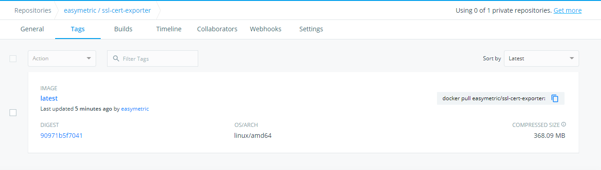
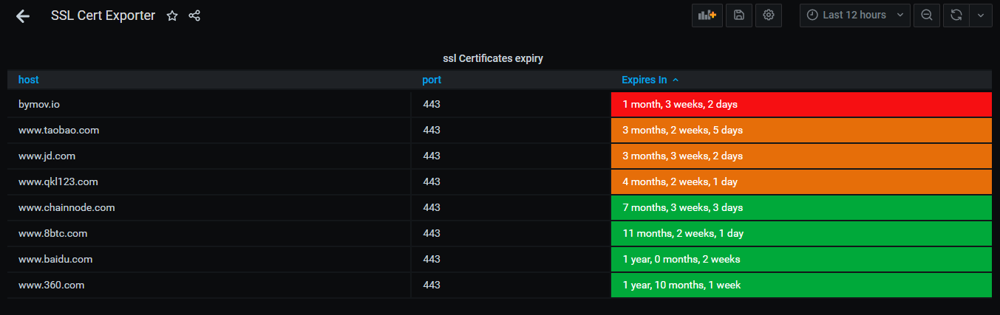

## https 证书过期exporter监控工具

>SSL Certificate Exporter.

针对公司业务特征：具有非常多的域名和子域名。而对应的域名和子域名的ssl 证书均来自采购。
当未及时续费和购买域名对应的证书时，一个是访问客户端会显示证书过期或者无效。形成安全告警。
一个是当业务直接调用开启了ssl证书校验，则会访问失败。


### 配置说明：

根据需要监控的站点的实际情况和端口，配置domains 列表。以下是配置demo。

```
[general]
timeout     = 600
debug       = false
port        = 8800
log_dir     = 'log'
log_file    = 'ssl-cert-monitor.log'

##########################
#list of host to monitor

[[domains]]
    host = 'www.8btc.com'
    port = 443

[[domains]]
    host = 'www.chainnode.com'
    port = 443

[[domains]]
    host = 'www.qkl123.com'
    port = 443

[[domains]]
    host = 'bymov.io'
    port = 443

[[domains]]
    host = 'www.baidu.com'
    port = 443

[[domains]]
    host = 'www.jd.com'
    port = 443

[[domains]]
    host = 'www.360.com'
    port = 443

[[domains]]
    host = 'www.taobao.com'
    port = 443
```


###使用方法 ：

***说明***：ssl-cert-exporter python 版本为3.7及以上。requirements.txt 内为所有相关依赖包。

ssl-cert-exporter 已经推到docker 官方仓库。



https://hub.docker.com/repository/docker/easymetric/ssl-cert-exporter


1：新建自己的config.toml 文件,根据自己的业务域名进行编辑保存，格式参考代码中config.toml。 放在自己想放的目录。

2：然后进行一下操作：
```
docker pull easymetric/ssl-cert-exporter:latest

docker run -d -p 8800:8800 -v /存放config.toml的目录/config.toml:/opt/ssl-cert-exporter/config.toml  easymetric/ssl-cert-exporter:latest
```


###Exportd Metrics 一览：

```

curl localhost:8800/metrics

# HELP ssl_cert_expiry_seconds check SSL certificate expiration dates 
# TYPE ssl_cert_expiry_seconds gauge
ssl_cert_expiry_seconds{host="www.8btc.com",port="443"} 2.9886194e+07
# HELP ssl_cert_expiry_seconds check SSL certificate expiration dates 
# TYPE ssl_cert_expiry_seconds gauge
ssl_cert_expiry_seconds{host="www.chainnode.com",port="443"} 2.0295794e+07
# HELP ssl_cert_expiry_seconds check SSL certificate expiration dates 
# TYPE ssl_cert_expiry_seconds gauge
ssl_cert_expiry_seconds{host="www.qkl123.com",port="443"} 1.1742194e+07
# HELP ssl_cert_expiry_seconds check SSL certificate expiration dates 
# TYPE ssl_cert_expiry_seconds gauge
ssl_cert_expiry_seconds{host="www.jd.com",port="443"} 9.789969e+06
# HELP ssl_cert_expiry_seconds check SSL certificate expiration dates 
# TYPE ssl_cert_expiry_seconds gauge
ssl_cert_expiry_seconds{host="www.360.com",port="443"} 5.8345679e+07
# HELP ssl_cert_expiry_seconds check SSL certificate expiration dates 
# TYPE ssl_cert_expiry_seconds gauge
ssl_cert_expiry_seconds{host="www.taobao.com",port="443"} 9.501261e+06

```

>ssl_cert_expiry_seconds 代表 距离当前时间的过期秒数 gauge 值。


### Dashboard 大盘一览：




